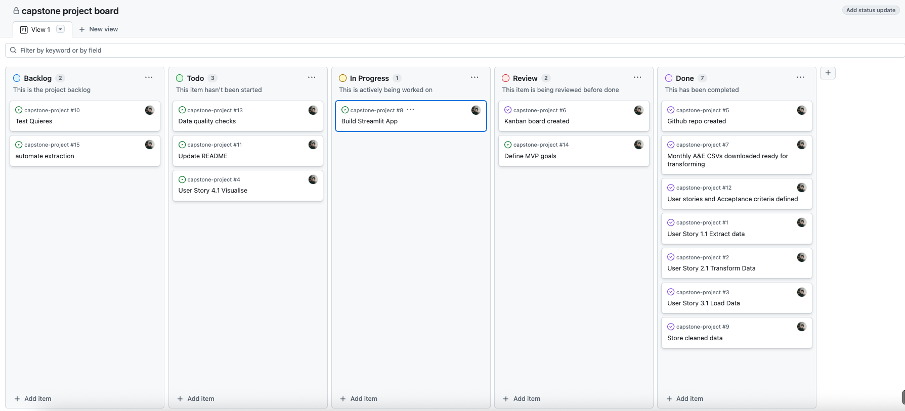
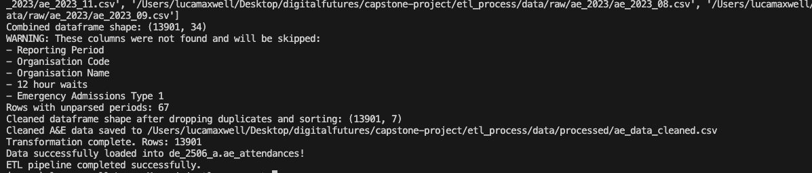

# 🏥 NHS A&E Data Pipeline & Dashboard

## Project Overview

This project builds a modular data engineering pipeline to extract, transform, and load publicly available NHS Accident & Emergency (A&E) datasets into a SQL database. The goal is to surface meaningful operational insights through interactive visualisations using Streamlit, helping NHS analysts, clinicians, and managers make data-driven decisions.

# Project Structure

```
├── etl_process
│   ├── config
│   │   ├── db_config.py
│   │   └── env_config.py
│   ├── data
│   │   ├── output
│   │   ├── processed
│   │   └── raw
│   ├── pyproject.toml
│   ├── requirements-setup.txt
│   ├── requirements.txt
│   ├── src
│       ├── extract
│       ├── load
│       ├── sql
│       ├── transform
│    ── scripts
│   │   ├── __init__.py
│   │   └── run_etl.py
└── streamlit
    ├── app.py
    └── nav_pages
        

```
---

## Plan

For this project, I chose to analyse A&E data from the National Health Service. After reviewing my selected dataset, I identified analytical questions that could yield valuable insights into the performance of A&E departments across the country. This process effectively guided the direction of my project.

Following this, I established a Kanban board within GitHub Projects and began defining user stories to outline the necessary steps for delivering the solution. I then utilised Jupyter Notebooks to conduct exploratory data analysis, which enhanced my understanding of what I could present in my application.

The project is centred around an end-to-end ETL pipeline, which I will discuss further below. Once my cleaned data was successfully loaded into my SQL database, I experimented with Streamlit to present my insights in a visually interactive manner.



### Improvements

I wanted to include this section here as I have reflected on my project and realised that there are many aspects I would approach differently. One significant area where I fell short was in testing. Unfortunately, I prioritised other tasks and ultimately ran out of time. In the future, I recognise the importance of adhering to best practices and will incorporate test-driven development into my work.

## Key Questions & Insights

- How has A&E performance changed over the last five years?
- Which trusts are under the most operational pressure?
- Where are the geographic hotspots for 12-hour breaches?

## Data Journey: ETL Pipeline

### Extract
- Raw CSVs downloaded from [NHS England](https://www.england.nhs.uk/statistics/statistical-work-areas/ae-waiting-times-and-activity/)
- Monthly trust-level data on attendances, breaches, 12-hour waits, and emergency admissions
- In the future or if I had more time, I would love to automate this process and write an extract script to grab data from NHS England on a monthly basis

### Transform
- Cleaned and filtered using pandas
- Removed rows with zero attendances or missing coordinates
- Converted `period` to datetime format
- Enriched with latitude/longitude for geospatial mapping
- Aggregated breach metrics and standardised trust codes

### Load
- Loaded into a PostgreSQL database (Pagila schema)
- Queried via modular SQL scripts for performance and maintainability

### Visualize
- Streamlit dashboard with multi-page layout:
  - National trends
  - Trust-level breach analysis
  - Geospatial pressure hotspots
 
### run_etl Successful



---

## Dashboard Features

### Home Page
- National % seen within 4 hours over time
- Top 5 trusts with the highest 12-hour waits
- Metric cards and line charts for quick insights

### Operational Pressure
- KPI breakdowns by present month (July 2025)
- Breach rate analysis and emergency admission trends

### Geospatial Mapping
- Interactive map showing trust-level pressure hotspots
- Sized and colored by 12-hour waits
- Hover reveals the trust name and attendance volume

---

## How to use the Dashboard
- Lauch the app
- Use sidebar to navigate between pages
- Hover over charts and maps for trust info

---

## Reflections & Takeaways

- Refactored Streamlit into a modular, multi-page app
- Debugged SQL query paths and ensured robust data loading
- Designed visuals that are both informative and intuitive
- Learned to balance technical depth with user experience

---

## Future Development & Deployment

### Testing
- In the future, I would use test-driven development to ensure I adhere to best practices

### Error Handling & Logging
- Add try/except blocks around SQL execution
- Log failed queries or empty datasets
- Use Streamlit’s `st.warning()` and `st.error()` for user feedback

### Security & Privacy
- No patient-level data used
- Trust-level metrics only
- DB access restricted via credentials and roles

### Cloud Deployment (AWS)
- S3: Store raw and transformed data
- RDS: Host PostgreSQL database
- Lambda: Automate ETL jobs
- CloudWatch: Monitor logs and alerts
- EC2: Host dashboard

---

## Tech Stack

- Python: pandas, pathlib, SQLAlchemy
- SQL: PostgreSQL, modular queries
- Streamlit: interactive dashboard
- Plotly: geospatial visualizations
- Git & GitHub: version control

---

## Setup Instructions

```bash
# Clone the repo
git clone https://github.com/your-username/capstone-project

# Set up virtual env
python(3 for mac) -m venv venv
# Mac users
source venv/bin/activate
# Windows users  
venv\Scripts\activate

# Install dependencies
pip install -r requirements.txt

# Run the app
streamlit run streamlit/app.py
```

